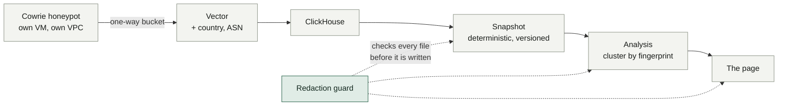

# What the internet does to an unguarded SSH server

**66,417 SSH sessions from 1,510 addresses reached a honeypot in two weeks. They are about sixty programs.**


<sub>The published report, regenerated weekly from live data. Rebuild with <code>scripts/refresh.sh</code>, then
<code>docs/screenshot.sh --top 1500</code>.</sub>

## In short

| | |
|---|---|
| **What** | An SSH honeypot that accepts almost any password and records everything typed |
| **Finding** | 1,510 attacking addresses are only **60 SSH client fingerprints** — one program runs from many hosts |
| **First attack** | **57.2 minutes** after the port opened |
| **The hard part** | Publishing your own sensor's data without leaking your own addresses |
| **As of** | 2026-09-28 · 518,476 events · 93 countries |

## How it works



## The guard came before the report

Publishing your own sensor's data means generating files in an environment that also holds your home address, your
phone's address, your cloud project and your lab's hosts. **Redaction by remembering does not survive the twentieth
regeneration of a page.** So the first thing built here was the guard:

```console
$ scripts/check-redactions.py --self-test
self-test passed — every planted value caught, no value printed, public addresses allowed

$ git commit -m "add today's figures"
  docs/leak-test.md:1: sensor-public-ip (34.47.x.x)
pre-commit: commit blocked by the redaction check.
```

The real values live in a git-ignored file, so **this repository has never contained them** and could be made public
without rewriting history. Findings are reported masked, so a failing check can be pasted anywhere.

<details>
<summary><b>It caught its author three times</b></summary>

Once on the guard's own source, where the sensor's address sat in a docstring example. Once on the exclusion list,
whose CIDR strings match the patterns they implement. And once on the snapshot itself — a scanner announces its target
inside its SSH version string, so the honeypot's own address arrives in attacker-supplied data as
`MGLNDD_<address>_22`. Dropping that row would hide a real finding, so the value is rewritten to a label and the
rewrite counted in the file's own metadata.

All three were fixed in the code rather than by exempting it. The first exemption would be the crack that lets a real
address through later.
</details>

## What the analysis found

The first thing I noticed in the raw data was six addresses in `109.160.32.0/24` with identical session counts — 1,437
each, to the event. The obvious reading was "one actor, six hosts in one subnet".

Clustering by SSH client fingerprint showed that reading was too small. The real group is **9 addresses spread across
Korea, Singapore and the United States**, and the `/24` itself splits across more than one client build — so neither
the subnet nor the country was the thing that held the group together. The tool was.

- **A second cluster runs from Germany, the United States, Vietnam and China at once**, which is why the page keeps a
  country ranking only to show why it misleads: that ranking splits one operator across four rows.
- **1,844 passwords were tried by exactly one fingerprint and only 199 by more than one.** The shared handful is the
  dictionary everyone has; the long tail is each program carrying its own list.
- **Two SFTP uploads of a file named `sshd`.** One has SHA-256 `e3b0c442…b855` — the hash of an empty file. The bot
  deployed its backdoor, uploaded nothing, and carried on as though it had worked.
- **524 addresses never completed a key exchange at all**: the majority of them, and almost none of the traffic.

<details>
<summary><b>How it is built</b></summary>

1. **Redaction guard** — `scripts/check-redactions.py`, with a self-test that plants every configured value.
2. **Snapshot** — `scripts/snapshot.py`: deterministic queries into a versioned JSON, my own traffic excluded by the
   query rather than by memory.
3. **Analysis** — `scripts/analyse.py`: clusters sessions by SSH client fingerprint, measures credential reuse between
   operators, and reconciles every derived figure against the snapshot before anything can be published.
4. **The page** — `scripts/build-site.py`: self-contained HTML rendered from those two files only.
5. **Freshness** — `scripts/refresh.sh` runs all four; a weekly systemd timer keeps the data current.
   [docs/limits.md](docs/limits.md) is the long form of what one sensor over a few days cannot say.
</details>

## Rules this project runs under

Nothing the honeypot captured is executed, unpacked or re-downloaded; captured files are recorded as hashes only.
No address from the data is ever contacted. The only outbound request is a VirusTotal hash lookup. The lab's database
is read-only here, and no port is opened. The full set is in [CLAUDE.md](CLAUDE.md).

---

Part of a set: [network monitoring](https://github.com/junting9817/nsm-lab) ·
[malware traffic](https://github.com/junting9817/malware-traffic-analysis) ·
[endpoint detection](https://github.com/junting9817/endpoint-detection) ·
[certificate transparency](https://github.com/junting9817/ct-lookalike-watch)
